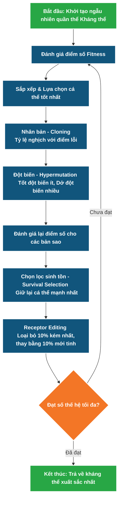

<p align="center">
  
  
  
  
</p>

# Đồ án môn học: Tính Toán Thông Minh (Computational Intelligence)
### Chủ đề: Clonal Selection Algorithm for Function Optimization

**👥 Nhóm thực hiện:**
- Chế Văn Nam
- Hồ Minh Khuyến
- Nguyễn Thành Nhân
- Lý Nguyễn

## 📝 Giới thiệu đề tài
Đề tài áp dụng **Thuật toán lựa chọn dòng vô tính (Clonal Selection Algorithm)** để giải quyết bài toán tối ưu hóa (tìm Min/Max) trên các hàm chuẩn (benchmark functions) như hàm **Sphere** và **Rastrigin**.

### 💡 Ý tưởng cốt lõi (Lấy cảm hứng từ đâu?)
Thuật toán bắt chước cách cơ thể con người phản ứng khi bị nhiễm bệnh:
* Khi có virus (Bài toán khó) xâm nhập, cơ thể tạo ra rất nhiều **Kháng thể** (Các phương án giải quyết ngẫu nhiên). 
* Cơ thể sẽ đánh giá xem kháng thể nào diệt virus tốt nhất (Độ thích nghi/Fitness cao). 
* Kháng thể tốt đó sẽ được giữ lại, **nhân bản (Cloning)** ra rất nhiều bản sao. Trong quá trình nhân bản, có xảy ra sự **đột biến (Mutation)** ngẫu nhiên để dò dẫm, tạo ra các thế hệ kháng thể sau xịn hơn thế hệ trước.

### 🔄 Mô hình luồng chạy (Workflow)
Sơ đồ dưới đây mô tả chính xác cách thuật toán hoạt động qua mỗi thế hệ:



### ⚙️ Áp dụng vào Máy tính (Tối ưu hóa Toán học)
Trong máy tính, chúng ta không có virus thật, mà thay vào đó là **Bài toán Tối ưu hóa**.
* Bạn hãy tưởng tượng mình đang đứng trên một dãy núi khổng lồ, sương mù mù mịt. Nhiệm vụ của bạn là phải tìm ra **thung lũng thấp nhất** (Giá trị Min của hàm số toán học Sphere hoặc Rastrigin).
* Thuật toán sẽ thả ngẫu nhiên 100 người lính (100 kháng thể) xuống dãy núi. Nó sẽ chọn ra những người đang đứng ở vị trí thấp nhất, nhân bản họ lên, và cho họ bước ngẫu nhiên (đột biến) để dò đường tiếp. 
* **[MỚI CẬP NHẬT] Cơ chế Receptor Editing (Chỉnh sửa thụ thể):** Nếu cứ đi dò dẫm, quân của bạn rất dễ bị kẹt ở một cái hố nhỏ (Local Minima) mà tưởng đó là đáy sâu nhất. Vì vậy, ở mỗi thế hệ, thuật toán sẽ "sa thải" 10% lính kém nhất và thả ngẫu nhiên 10% lính mới tinh xuống các vị trí ngẫu nhiên trên bản đồ. Nhờ vậy, quần thể luôn có sự đột phá mới để nhảy ra khỏi các hố bẫy ảo (như ở hàm Rastrigin).
* Cứ lặp đi lặp lại 100-500 vòng lặp (Thế hệ/Generations), đội quân của bạn chắc chắn sẽ "đổ dồn" về đúng cái đáy thấp nhất của dãy núi.

## 🚀 Các công cụ sử dụng
- **Ngôn ngữ:** Python
- **Thư viện Thuật toán:** NumPy, PyGAD (so sánh GA)
- **Thư viện Trực quan hóa:** Matplotlib, tqdm

## 📂 Cấu trúc thư mục
- `src/`: Thư mục chứa toàn bộ Source Code của đồ án.
  - `benchmark_functions.py`: Chứa các hàm toán học mục tiêu (Sphere, Rastrigin).
  - `clonal_selection.py`: Cấu trúc cốt lõi của thuật toán Clonal Selection.
  - `ga_comparison.py`: Code thuật toán Di truyền (PyGAD).
  - `visualization.py`: Code vẽ đồ thị trực quan (Matplotlib).
  - `statistics.py`: File phân tích và thống kê kết quả chạy nhiều lần.
  - `main.py`: File chạy chính.
- `requirements.txt`: Danh sách các thư viện cần thiết.
- `README.md`: File giới thiệu tổng quan đồ án (đang xem).

## 🛠️ Hướng dẫn cài đặt
1. Cài đặt các thư viện yêu cầu:
   ```bash
   pip install -r requirements.txt
   ```
2. Chạy file chính (Xem biểu đồ trực quan):
   ```bash
   python src/main.py
   ```
3. Chạy bài test Thống kê (So sánh độ ổn định và thời gian sau 30 lần chạy độc lập):
   ```bash
   python src/statistics.py
   ```

## 📚 Tài liệu tham khảo
1. **Hướng dẫn DataCamp về Artificial Immune System với phần Clonal Selection trong Python:** 
   [https://www.datacamp.com/tutorial/artificial-immune-system](https://www.datacamp.com/tutorial/artificial-immune-system)
2. **Repo GitHub triển khai Clonal Selection Algorithm bằng Python và Jupyter:** 
   [https://github.com/christianrfg/clonalg](https://github.com/christianrfg/clonalg)